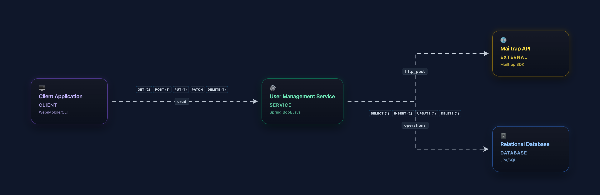

# Applying SOLID Principles in Practice with Java

> 🇧🇷 Leia esta documentação em português em `README-BR.md`.

This project was created to study and demonstrate the **SOLID** principles in practice using **Java** and **Spring Boot**.  
In addition to the SOLID-focused code examples, the project is already configured to connect to an **Autonomous Database** on **Oracle Cloud (OCI)** using an **Oracle Wallet** and database migrations managed by **Flyway**.

## Main technologies

- Java 17  
- Spring Boot 3 / Spring Web MVC  
- Oracle JDBC (`ojdbc11`)  
- Flyway (database migrations)  
- Autonomous Database (OCI)

## Connecting to Autonomous Database (OCI) using Wallet

The infrastructure is already set up to connect the project to an Autonomous Database on OCI:

- Oracle JDBC driver dependency added in `pom.xml` (`com.oracle.database.jdbc:ojdbc11-production`).
- Datasource configuration pointing to Oracle in `src/main/resources/application.properties`.
- Versioned database migrations in `src/main/resources/db/migration`.
- Simple endpoint to test the database connection: `GET /test-db` in `TestController`.

### 1. Downloading and configuring the Wallet

1. Create (or use) an **Autonomous Database** on OCI.  
2. In the OCI console, download the **Client Credentials (Wallet)** for your database.  
3. Extract the Wallet `.zip` file to a local directory, for example:

   ```bash
   ~/wallets/my-autonomous-db
   ```

4. Optionally, set the `TNS_ADMIN` environment variable pointing to this directory (the Oracle driver uses this path to locate the Wallet configuration files):

   ```bash
   export TNS_ADMIN=~/wallets/my-autonomous-db
   ```

### 2. Environment variables used by Spring Boot

The `application.properties` file is configured to read database credentials and connection URL from environment variables:

- `DB_URL`  
- `DB_USER`  
- `DB_PASS`

An example `DB_URL` for an Autonomous Database (adjust with your real environment values) is:

```bash
export DB_URL="jdbc:oracle:thin:@my_db_high?TNS_ADMIN=$HOME/wallets/my-autonomous-db"
export DB_USER="DB_USER"
export DB_PASS="DB_PASSWORD"
```

> Note: the exact connection string is generated by OCI (in the Autonomous Database details page). Always use the URL and alias recommended by OCI.

### 3. Migrations with Flyway

Database migrations are managed by **Flyway**, which is automatically initialized when the application starts:

- Migrations location: `src/main/resources/db/migration`
- Existing examples:
  - `V1__create_table_user.sql`
  - `V2__create_users_table_and_trg.sql`

When the application starts with the database reachable and the environment variables properly configured, Flyway will automatically apply these migrations to the Autonomous Database instance.

### 4. Testing the database connection

With the project running (for example using `mvn spring-boot:run` or via your IDE), you can quickly test if the application is able to connect to the database by accessing:

- `GET /test-db`

`TestController` opens a connection through the `DataSource` configured by Spring Boot and returns a simple message indicating whether the connection was successful.

## Next steps in SOLID

Beyond the database infrastructure, the repository contains examples related to the **Single Responsibility Principle** within the package:

- `src/main/java/com/natanfelipe/solid/solid/SingleReponsibilityPrinciple`

For a SRP-focused guide (diagram + flow walkthrough), see: `docs/SRP.md`.
As the project evolves, more SOLID principles will be implemented and documented here, always keeping the same Autonomous Database connection setup on OCI so that the examples stay close to real-world scenarios.

## REST API: Users resource

The main business example in the project is a simple **Users** CRUD, exposed under the `/users` path:

- `GET /users` – returns the list of users.  
- `GET /users/{id}` – returns the details of a single user.  
- `POST /users` – creates a new user.  
- `PUT /users/{id}` – updates an existing user.  
- `DELETE /users/{id}` – deletes a user.

The payload used in `POST /users` and `PUT /users/{id}` follows the `UserDTO` structure:

```json
{
  "firstName": "Ada",
  "lastName": "Lovelace",
  "email": "ada@example.com",
  "phone": "+55 11 99999-0000",
  "pix": "ada-pix-key",
  "crc": "123456"
}
```

Internally, the endpoint delegates all business logic to `UserService`, which:

- maps the DTO to the `Users` JPA entity;  
- persists the entity through `UserRepository`;  
- publishes a `UserCreatedEvent` after a successful creation.

## Single Responsibility in practice: events and e‑mails

The **Single Responsibility Principle** is applied around the user creation flow by splitting responsibilities across small, focused components:

- `UserController` – exposes the HTTP endpoints and delegates to the service layer.  
- `UserService` – contains the application logic to manage users and publishes a `UserCreatedEvent` when a new user is created.  
- `UserCreatedEvent` – value object that carries the created `Users` instance.  
- `UserMailListener` – listens to `UserCreatedEvent` and is responsible for preparing the `Email` model and invoking the mail service.  
- `EmailService` (through the `IMail` interface) – encapsulates the integration with **Mailtrap** and actually sends the e‑mail.

With this design:

- user persistence does **not** know anything about e‑mail infrastructure;  
- e‑mail sending does **not** know about persistence or HTTP;  
- each class has one clear reason to change (respecting SRP).



## Mailtrap configuration (e‑mail sandbox)

To send e‑mails when a new user is created, the project uses **Mailtrap** as an e‑mail sandbox.  
The `EmailService` reads configuration from `application.properties`:

- `mailtrap.token=${MAILTRAP_TOKEN}`  
- `mailtrap.sender=${MAILTRAP_SENDER}`

Before starting the application, configure the following environment variables:

```bash
export MAILTRAP_TOKEN="your-mailtrap-api-token"
export MAILTRAP_SENDER="from@example.com"
```

These values are used to build the Mailtrap Java client and send an e‑mail with a personalized subject like:

> `Hello, user@example.com from Java SRP (Single Responsibility Principle)!`

This flow, triggered by user creation and decoupled via events, complements the database setup and demonstrates how SOLID principles can be applied in a realistic, end‑to‑end scenario.
